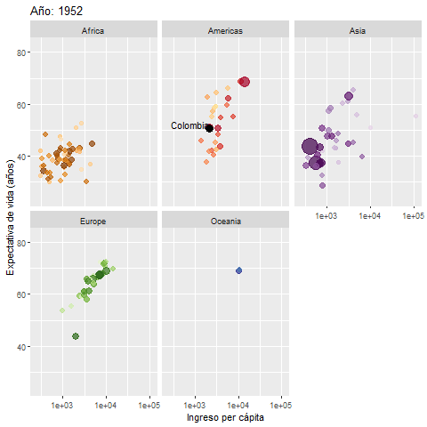

<center>
<h2>Welcome to my webpage!!!</h1>
</center>

```{r fig.asp=0.30, fig.align='center', echo=FALSE, eval=FALSE}
library(png)
library(grid)
img <- readPNG("imagenes/cover.png")
grid.raster(img)
```

<br />

Next figure depictes the life expectancy for Colombia since 1953, figure was made with [gganimated](https://github.com/thomasp85/gganimate) package.

<center>

</center>
